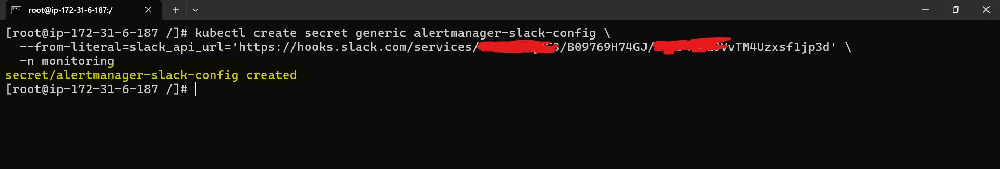

# 📘️ Monitoring Setup Documentation — Prometheus, AlertManager & Grafana on AKS

## Overview

This documentation showcase my hands-on experience configuring a complete monitoring setup using **Prometheus and Grafana** on an **Azure Kubernetes Service (AKS)** cluster. My objective was to implement a production-grade, real-time monitoring setup capable of observing both cluster-wide and application-specific performance metrics. To achieve this, I deployed the **kube-prometheus-stack** using the Helm package manager, customized it for enterprise-like resilience, and extended it to support alerting and persistent storage.

---

## Prerequisites

Before beginning, I ensured the following setup was in place:

* A running **AKS cluster** (already provisioned and configured)
* `kubectl` configured to access the AKS cluster
* Helm v3+ installed locally
* Azure CLI installed for cluster access and validation
* A dedicated `monitoring` namespace created to isolate observability components

---

## Step 1: Add Helm Repository

I started by adding the Prometheus Community Helm chart repository, which provides the stable and community-maintained `kube-prometheus-stack`.

```bash
helm repo add prometheus-community https://prometheus-community.github.io/helm-charts
helm repo update
```


This ensured I was pulling the latest metadata for chart installation.

---

## Step 2: Create Namespace for Monitoring Stack

To logically separate monitoring workloads and apply RBAC/policies if needed, I created a new namespace:

```bash
kubectl create namespace monitoring
```


---

## Step 3: Install kube-prometheus-stack via Helm

I used the official Helm chart to deploy the entire observability stack. This included Prometheus, Grafana, Node Exporter, kube-state-metrics, and Alertmanager.

```bash
helm install prometheus-stack prometheus-community/kube-prometheus-stack \
  --namespace monitoring \
  --set grafana.service.type=LoadBalancer 
```


To verify what resources are created from prometheus stack i ran:

```bash
kubectl get pods -n monitoring
```


### Resources Installed:

This chart created several components that are essential for enterprise monitoring:

* **Prometheus Server** — Core metrics collection engine that scrapes targets using service discovery.
* **Grafana** — Visualization and dashboarding tool to display collected metrics.
* **Alertmanager** — Handles alert dispatching via Slack, email, etc.
* **kube-state-metrics** — Exposes Kubernetes object states such as Deployments, Pods, and Nodes.
* **Node Exporter** — Collects OS and node-level metrics.
* **Prometheus Operator** — Manages the entire Prometheus lifecycle declaratively.

These components are tightly integrated and work together to deliver observability.


---

## Configure Persistent Storage for Prometheus 
For production-grade reliability, I customized the Helm values to enable **persistent volume storage** for Prometheus data. This helps avoid metric loss across pod restarts.

```bash
# prometheus-values.yaml
prometheus:
  prometheusSpec:
    storageSpec:
      volumeClaimTemplate:
        spec:
          accessModes: ["ReadWriteOnce"]
          resources:
            requests:
              storage: 5Gi
```

Then upgraded the release using:

```bash
helm upgrade prometheus-stack prometheus-community/kube-prometheus-stack \
  -n monitoring -f prometheus-values.yaml
```


---

## Step 4: Access the Grafana Dashboard

Once deployed, I fetched the external IP of the Grafana service to access it from the browser:

```bash
kubectl get svc -n monitoring
kubectl get svc -n monitoring -l "app.kubernetes.io/name=grafana"
```


Then I retrieved the admin password stored in a Kubernetes secret:

```bash
kubectl get secret --namespace monitoring prometheus-stack-grafana \
  -o jsonpath="{.data.admin-password}" | base64 --decode ; echo
```


* **Username**: `admin`
* **Password**: prom-operator

I then logged into Grafana via the LoadBalancer IP.


Just like grafana i viewed prometheus web interface as well where we can fetch data based on promQl queries but for the visualization grafana will be more efficient


---

## Step 5: Explore Built-In Dashboards

Grafana came pre-configured with several dashboards which were incredibly helpful out of the box. These included:


* **Kubernetes / Nodes**
* **Kubernetes / Deployments**
* **Kubernetes / Pods**
* **API Server, Scheduler, Controller Manager Metrics**
* **etcd metrics**
* **Node Exporter metrics**
* **Prometheus metrics**


These dashboards gave me instant visibility into my cluster's health and resource consumption.

---

## Step 6: Create Custom Dashboards and Alerts

After exploring default dashboards, I started creating **custom dashboards** tailored for my AKS workloads. These included:

* **Application latency and error rate**
* **Namespace-level CPU/memory usage**
* **Pod-level resource utilization**

I also configured **alerting rules** using Alertmanager, and integrated it with Slack using a webhook configuration to notify me of CPU throttling, pod restarts, and high memory usage.

---

## Step 7: Alerting with Alertmanager

Once dashboards were configured, I moved on to sending alerts to Slack. I did this to ensure our team could react in real time to critical issues like high CPU utilization.

###  Step-by-step Slack alert integration:

#### 1. **Create Slack Incoming Webhook**

* Went to: [https://api.slack.com/messaging/webhooks](https://api.slack.com/messaging/webhooks)
* Selected my workspace and created a new **Incoming Webhook**.
* Choosen the target channel as `#graphana-alerts`).
* Copy the webhook URL.

#### 2. **Create Kubernetes Secret for the webhook**

We need to store the webhook URL securely:

```bash
kubectl create secret generic alertmanager-slack-config \
  --from-literal=slack_api_url='https://hooks.slack.com/M4Uzxsf1jp3d' \
  -n monitoring
```



> 🛡️ This avoids exposing sensitive info directly in the Alertmanager config.

I verified that slack channel is correctly configured


#### 3. **Patch Alertmanager config using Helm values override**

Created a file `alertmanager-values.yaml` and patched with slack channel and webhook

#### 4. **Upgrade the Helm release**

```bash
helm upgrade prometheus-stack prometheus-community/kube-prometheus-stack \
  -f alertmanager-values.yaml \
  --namespace monitoring
```


✅ Now, alerts like high CPU usage will be sent to Slack!

#### 5. **Create Sample CPU Alert Rule**

Create a PrometheusRule to test it:

```yaml
apiVersion: monitoring.coreos.com/v1
kind: PrometheusRule
metadata:
  name: cpu-alert
  namespace: monitoring
spec:
  groups:
    - name: node-cpu-alerts
      rules:
        - alert: HighCPUUsage
          expr: (100 - (avg by(instance) (rate(node_cpu_seconds_total{mode="idle"}[5m])) * 100)) > 30
          for: 1m
          labels:
            severity: warning
          annotations:
            summary: "Node CPU usage is above 30%"
```

Apply the rule:

```bash
kubectl apply -f cpu-alert-rule.yaml
```

Now, if any node CPU usage crosses 30%, we'll receive a Slack alert in the configured channel.


---

## Conclusion
By setting up Prometheus and Alertmanager with Slack integration, and visualizing everything via Prometheus and Grafana dashboards, I built a complete monitoring and alerting system for my Kubernetes cluster. This setup ensures proactive issue detection and seamless communication through real-time alerts.

---