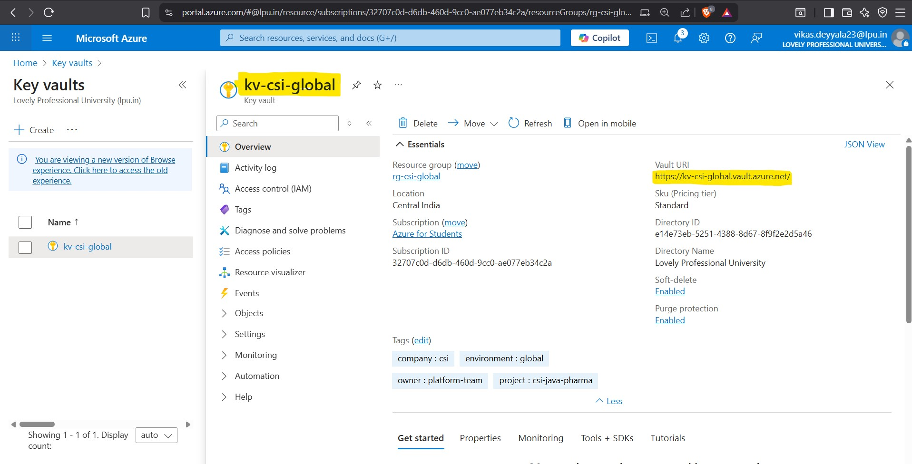

# 🛠️ Infrastructure Implementation Guide — CSI Java Pharma App (Azure + Terraform)

This document explains, in a clear and detailed manner, how I provisioned the entire cloud infrastructure for the **CSI Java Pharma Application** using **Terraform on Azure**. The process was carried out environment-wise, beginning with shared **global resources**, followed by the provisioning of isolated infrastructure for **Dev**, **QA**, **Staging**, and **Production** environments. Each section includes detailed steps, Terraform commands, and Azure Portal screenshots. 

This is written from my personal implementation experience, focusing on clarity so that even team members who are not familiar with Terraform, Azure, or cloud infrastructure can follow and understand the complete setup.

The infrastructure is divided into:

* **Global shared resources** used by all environments
* **Environment-specific resources** for `dev`, `qa`, `staging`, and `prod`

Each step in this document includes:

* Exact Terraform commands I ran
* Purpose of each action
* What to expect as output
* Snapshots (to be filled in)
* What each resource is used for in the application

---

### Provisioning Global Shared Resources

I started by provisioning the global shared infrastructure that supports all environments. These are provisioned only once and reused by all environments (dev, qa, staging, prod).

```bash
cd /global-resources
terraform init
```

### 1️⃣ Terraform Initialization

This command initialized the Terraform working directory. It:

* Downloads the Azure provider and modules
* Sets up the backend connection to the Azure Blob Storage
* Prepares the directory for planning and applying changes

> The remote backend is very important because it allows state sharing across teams and keeps the `.tfstate` file secure, versioned, and locked during operations.


The state file is stored in a remote Azure Blob Storage container, providing a secure and centralized place for Terraform state.


---

### 2️⃣ Terraform Validation

```bash
terraform validate
```

This command ensures that the configuration files are syntactically correct and well-structured.

> This step prevents errors during plan/apply by catching basic misconfigurations.


---

### 3️⃣ Terraform Plane

```bash
terraform plan -out=tfplan
```

This command generated an execution plan, showing all resources that will be created, modified, or destroyed and backend locked the state file, ensuring no parallel changes could happen.

> I always save the plan output to a file (`tfplan`) so I can apply it later. This helps in automation and ensures repeatability of the exact resource plan.
 


---

### 4️⃣ Terraform Apply

```bash
terraform apply tfplan
```
This step created the global resources on Azure. I verified each of them using Azure Portal after successful apply.


The resources were successfully provisioned, and the state file was stored in `Azure Blob Storage` under the container `tfstatecontainer` for centralized management.


To verify that all resources have been successfully created and are listed correctly in the `rg-csi-global` resource group, you can run the following command in your Azure CLI:

```bash
az resource list --resource-group rg-csi-global --output table
```

This will display a list of all resources within the `rg-csi-global` resource group in a tabular format, making it easy to verify their creation.


---

### Resources Created and Their Role in the Project

#### 🔐 Azure Key Vault (`kv-csi-global`)

Used for securely storing secrets such as:

* MySQL passwords
* ACR credentials
* External APIs or internal tokens

> The application will access this via CSI driver or External Secrets Operator.



#### Azure Container Registry (`acrglobalcsi`)

Stores all Docker images built via CI pipelines for backend and frontend microservices. Integrated with AKS for secure image pulls.


#### Azure Log Analytics Workspace (`csi-log-analytics`)

Centralized workspace for gathering, analyzing, and visualizing logs from different sources like Application Insights, AKS, VMs, and other resources. Helps in monitoring the health of the infrastructure and applications.


#### Application Insights (`appi-csi-global`)

Used for collecting logs, traces, and metrics from our applications. Helps in debugging and performance monitoring.


#### Virtual Machines (SonarQube & Nexus)

* **SonarQube** for code quality checks
* **Nexus** for artifact storage (Maven dependencies, JARs)
  These are accessible internally only for CI/CD pipelines.

  

  

With the global shared resources successfully provisioned, our infrastructure is now ready to support all environments (dev, qa, staging, prod) seamlessly, providing a robust foundation for the entire project.

---

### Provisioning `dev` Environment

Now that the global resources are in place, I moved on to provisioning the dev environment. This environment is isolated from others, meaning it has its own Resource Group (RG), VNet, and AKS cluster, separate from any other environments.

The steps I followed are almost identical to those used in the Global Resources setup, with a focus on creating environment-specific infrastructure.

### 1️⃣ Terraform Initialization

The first step was to initialize Terraform within the `dev` directory to set up the necessary files and remote backend for state management.

```bash
cd environments/dev
terraform init
```


### 2️⃣ Terraform Validation
After initializing, I ran the following command to validate the Terraform configuration:

```bash
terraform validate
```


### 3️⃣ Terraform Plane

Now, it was time to generate the execution plan, which shows all the resources that will be created, modified, or destroyed.

```bash
terraform plan -out=tfplan
```


After applying the Terraform configuration, the state file for the `dev` environment is stored in Azure Blob Storage under the following location:

- **Storage Account**: `csiterraformstate`
- **Container**: `tfstate`
- **State File**: `dev-infra.terraform.tfstate`

This ensures that the Terraform state is securely stored and managed centrally for the `dev` environment.

It uses the `terraform.tfvars` file to load environment-specific variables like network CIDR blocks, VM sizes, etc.

### 4️⃣ Terraform Apply
Once the plan was reviewed and confirmed, I applied it to provision the resources in Azure.

```bash
terraform apply tfplan
```


This step performs the actual provisioning of the infrastructure. The resources are created according to the plan we reviewed earlier.

> **Key Considerations:** I always double-check the output of the plan before applying it to avoid unexpected changes.

---

### Dev Resources & Explanation

Now let’s break down the resources provisioned in the `dev` environment and how each of them is used in the application.

### Resource Group (`rg-csi-dev`)

The **Resource Group** is the top-level container in Azure for managing all resources for this environment.

- **Purpose**: All `dev` resources are logically grouped together for easier management.
- **Structure**: This RG contains all the specific resources, including **AKS**, **VNet**, and other services.

> **Why it’s useful**: By using a dedicated resource group for `dev`, it ensures isolation from other environments, allowing for independent lifecycle management (create, update, delete).

📸 **Snapshot**: 

### 🌐 Virtual Network (`vnet-csi-dev`)

The **Virtual Network** (VNet) ensures that all resources in this environment can securely communicate with each other.

- **Purpose**: Provides internal networking for Azure resources.
- **Subnets**: The VNet is split into three subnets:
  - **system**: For AKS system components.
  - **app**: For application pods and service meshes.
  - **monitoring**: Dedicated for Prometheus, Grafana, and monitoring agents.

> **Why it’s useful**: Subnet separation enhances security and allows better network management via **Network Security Groups** (NSGs) on each subnet.


### ☸️ Azure Kubernetes Service (AKS) (`aks-csi-dev`)

The **AKS** cluster is the central piece for running containerized workloads in the `dev` environment.

- **Private Cluster**: Only accessible via VPN or internal networks, ensuring that external threats cannot access the environment.
- **Node Pools**: Two node pools were set up:
  - **System Node Pool**: Runs Kubernetes control-plane components.
  - **App Node Pool**: Runs the application workloads (pods).

> **Why it’s useful**: AKS abstracts much of the complexity of managing Kubernetes clusters, offering automatic scaling, patching, and security updates. It enables **DevOps teams** to focus on application development and deployment.


---

### Provisioning `qa` Environment

Following the successful creation of the `global resources` and the `dev` environment, I moved on to provisioning the `QA` environment. This environment mirrors the dev environment to a large extent, but it's meant for more stable builds and integrated testing.

Just like the dev environment, the QA environment has its own Resource Group, VNet, and AKS cluster, which ensures complete isolation from the other environments.

### 1️⃣ Terraform initialization

First, I navigated to the `qa` directory and initialized the Terraform working directory for the environment.

```bash
cd environments/qa
terraform init
```

### 2️⃣ Terraform Validation

Next, I ran the validation step to ensure that the Terraform configuration was error-free and well-formed.

```bash
Terraform Validation
```


### 3️⃣ Terraform Plane
Once validation was successful, I generated the execution plan using:

```bash
terraform plan -var-file="qa.tfvars" -out=tfplan
```


After applying the Terraform configuration, the state file for the `qa` environment is stored in Azure Blob Storage under the following location:

- **Storage Account**: `csiterraformstate`
- **Container**: `tfstate`
- **State File**: `qa-infra.terraform.tfstate`

This ensures that the Terraform state is securely stored and managed centrally for the `qa` environment.

### 4️⃣ Terraform Apply 

After reviewing the plan, I applied the changes to provision the resources in the qa environment:

```bash
terraform apply
```


### Resources Provisioned in `QA` Environment

- **Resource Group** (`rg-csi-qa`) – Successfully provisioned for organizing QA-specific resources.
  
  

- **Virtual Network** (`vnet-csi-qa`) – Successfully provisioned for secure networking in the QA environment.

  

- **Azure Kubernetes Service (AKS)** (`aks-csi-qa`) – Successfully provisioned for containerized workload management and build validation.


The **QA** environment was successfully provisioned, which includes the necessary resources to support testing, integration, and performance validation of application builds before they are promoted to staging.

---

### Provisioning `staging` Environment

### 1️⃣ Terraform initialization

First, I navigated to the `staging` directory and initialized the Terraform working directory for the environment.

```bash
cd environments/staging
terraform init
```

### 2️⃣ Terraform Validation

Next, I ran the validation step to ensure that the Terraform configuration was error-free and well-formed.

```bash
Terraform Validation
```


### 3️⃣ Terraform Plane
Once validation was successful, I generated the execution plan using:

```bash
terraform plan -out=tfplan
```


After applying the Terraform configuration, the state file for the `staging` environment is stored in Azure Blob Storage under the following location:

- **Storage Account**: `csiterraformstate`
- **Container**: `tfstate`
- **State File**: `staging-infra.terraform.tfstate`

This ensures that the Terraform state is securely stored and managed centrally for the `staging` environment.


### 4️⃣ Terraform Apply 

After reviewing the plan, I applied the changes to provision the resources in the qa environment:

```bash
terraform apply
```


### Resources Provisioned in `Staging` Environment

- **Resource Group** (`rg-csi-staging`) – Successfully provisioned for isolating staging-specific resources.

  

- **Virtual Network** (`vnet-csi-staging`) – Successfully provisioned for secure networking in the Staging environment.

  

- **Azure Kubernetes Service (AKS)** (`aks-csi-staging`) – Successfully provisioned for containerized workload management and release candidate testing.

  


The **Staging** environment, which closely mirrors the production setup, was successfully provisioned to facilitate testing of release candidates before deploying to production.

---

### Provisioning `prod` Environment

### 1️⃣ Terraform initialization

First, I navigated to the `prod` directory and initialized the Terraform working directory for the environment.

```bash
cd environments/prod
terraform init
```

### 2️⃣ Terraform Validation

Next, I ran the validation step to ensure that the Terraform configuration was error-free and well-formed.

```bash
terraform validate
```


### 3️⃣ Terraform Plane
Once validation was successful, I generated the execution plan using:

```bash
terraform plan -out=tfplan
```


After applying the Terraform configuration, the state file for the `prod` environment is stored in Azure Blob Storage under the following location:

- **Storage Account**: `csiterraformstate`
- **Container**: `tfstate`
- **State File**: `prod-infra.terraform.tfstate`

This ensures that the Terraform state is securely stored and managed centrally for the `prod` environment.


### 4️⃣ Terraform Apply 

After reviewing the plan, I applied the changes to provision the resources in the qa environment:

```bash
terraform apply
```
---

### Conclusion

The infrastructure for the `CSI Java Pharma Application` was successfully provisioned on Azure using Terraform, covering Global Shared Resources, Dev, QA, Staging, and Production environments. By isolating each environment and using consistent, repeatable Terraform configurations, we ensured smooth deployments, secure resource management, and high availability.

This setup ensures smooth development, testing, and deployment pipelines, providing a robust foundation for the CSI Java Pharma Application’s growth.